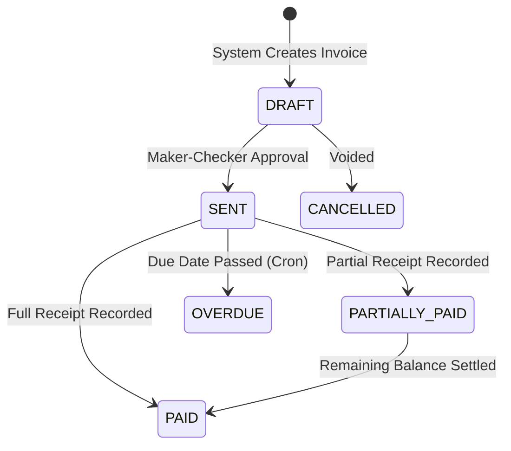
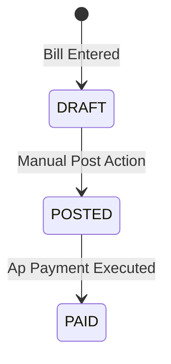
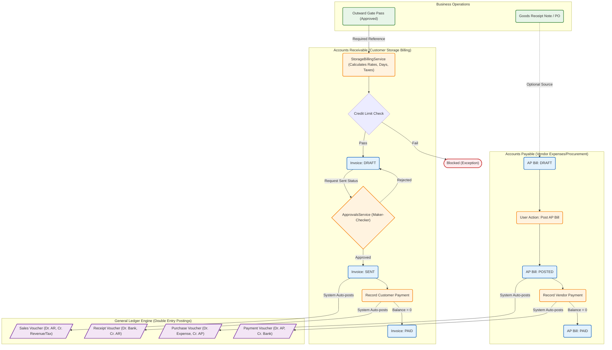

# Cold Store ERP - Invoicing and Billing Workflow

This document extracts and outlines the business logic for the various invoicing and billing workflows within the ERP system, specifically handling the Cold Storage operations (AR) and standard procurement/expenses (AP).

## 1. Storage & Rental Billing Logic (Accounts Receivable)

The core revenue generation for the Cold Store relies on billing customers for space utilization and handling.

### 1.1 Trigger & Validation
*   **Trigger:** Invoices for `STORAGE` are predominantly generated by the `StorageBillingService`.
*   **Validation Rule (Gate Pass Linkage):** A storage invoice **must** be tied to an `APPROVED` Outward Gate Pass (referenced via `referenceNumber` starting with `GPO-`). This ensures customers are only billed when goods leave the facility (or during month-end accruals).
*   **Credit Limit Protection:** Before invoice creation, the system evaluates:
    `Current Debt + New Invoice Amount <= Customer Credit Limit`.
    If breached, generation is aggressively blocked.

### 1.2 Rate Determination Hierarchy
The system calculates the daily storage rate (`PKR / kg / day`) using a strict fallback hierarchy:
1.  **Explicit Rate:** Used if specifically provided in the request payload.
2.  **Customer-Specific Rate:** Looked up in `BillingRateConfiguration` by `customerId` and active date.
3.  **Category-Specific Rate:** Looked up by `productCategoryId`.
4.  **Duration-Based Default Rate:** Based on `daysStored` (e.g., ≥ 60 days = Monthly, ≥ 30 days = Seasonal, else Daily).
5.  **Hardcoded Fallbacks:** If DB config is missing (Daily: 2.0, Seasonal: 1.5, Monthly: 1.2).

### 1.3 Billing Calculation Formula
```text
Days Stored (rounded UP to whole days, min 1) = Date Out - Date In

Storage Charges = Weight (kg) × Rate (PKR/kg/day) × Days Stored
Labour Charges  = Inbound Labour + Outbound Labour
Loading Charges = Loading/Unloading fees
Other Charges   = Any miscellaneous adjustments

Subtotal = Storage Charges + Labour Charges + Loading Charges + Other Charges
```

### 1.4 Taxation
*   **GST (Output Tax):** Added to the subtotal. Calculated dynamically via `TaxService` based on customer profiles.
*   **WHT (Withholding Tax):** Deducted from the subtotal. Treated as an advance tax paid by the customer.
*   **Total Payable Amount** = `Subtotal + GST Amount - WHT Amount`

---

## 2. Invoice Lifecycle & GL Integration (AR Workflow)

### 2.1 State Machine


### 2.2 Maker-Checker Engine
To prevent unauthorized revenue recognition, jumping from `DRAFT` to `SENT` must go through the `ApprovalsService` (`MARK_AS_SENT` action). Only upon strict approval does the invoice affect the General Ledger.

### 2.3 General Ledger (GL) Postings for AR Invoices
When the invoice transitions to `SENT`, a Sales Voucher is generated automatically:

| Account Type | GL Account Nature | Math | Amount |
| :--- | :--- | :--- | :--- |
| **Credit** | `SERVICE_REVENUE` (Income) | `+` | Subtotal |
| **Credit** | `GST_PAYABLE` (Liability) | `+` | GST Amount |
| **Debit** | `WHT_RECEIVABLE` (Asset) | `+` | WHT Amount |
| **Debit** | `Customer AR Account` (Asset) | `+` | Total Payable Amount |

*When a payment is recorded (`ApPayment`), a Receipt Voucher is created crediting Customer AR and debiting Cash/Bank.*

---

## 3. Credit and Debit Notes

When issuing CN/DNs against an original invoice, the ERP dynamically apportions the subtotal, GST, and WHT based on the ratio of the Note Amount to the Original Invoice Total.
*   `Adjustment Ratio = Note Amount / Original Total Amount`
*   Corresponding GL Vouchers reverse the native entries proportionately.

---

## 4. Accounts Payable Logic (Expenses & Procurement)

Billing for internal expenses (like utility bills for cold rooms) or procurement operates through the `ApBill` entities.

### 4.1 Trigger & Structure
*   **Created For:** Vendors (utility companies, maintenance contractors).
*   **Line Items:** Each bill contains multiple lines mapped directly to specific **Expense Accounts** (e.g., `Electricity Expense - Chamber 1`).

### 4.2 State Machine


### 4.3 General Ledger (GL) Postings for AP Bills
When a user manually posts a `.DRAFT` bill, the `ApBillsService` checks if the vendor has a configured Payable GL account, then creates a Journal/Purchase Voucher:

| Account Type | GL Account Nature | Math | Amount |
| :--- | :--- | :--- | :--- |
| **Debit** | `Individual Expense Accounts` (Expense)| `+` | Line Amount + Line Tax |
| **Credit** | `Vendor AP Account` (Liability) | `+` | Total Bill Amount |

### 4.4 Cold Store Specific Allocation (Future Roadmap as per Audit)
Currently, AP Utility Bills hit general expense accounts. The strategic roadmap (`todo.md`) dictates that AP lines should map to specific Chamber `cost_center_id`s. At month-end, these AP expenses will be prorated across active `ColdStoreLot` records residing in those chambers based on capacity utilization to determine true profitability per customer.

---

## 5. End-to-End Workflow Diagram

The following diagram provides a high-level visual summary of the interconnected AR, AP, and GL workflows detailed above.


