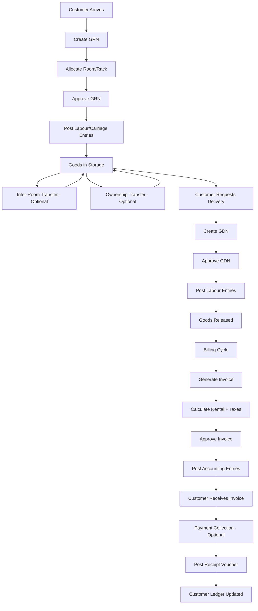

# Legacy Business Workflows Documentation
**Project:** Advance ERP System Modernization  
**Date:** October 15, 2025  
**Purpose:** Complete documentation of business processes and workflows  

---

## Executive Summary

This document provides comprehensive documentation of all business workflows in the legacy Advance ERP system, focusing on the **cold storage facility management** for agricultural products. These workflows represent years of refined business processes and must be preserved and enhanced in the modernized system.

**Core Business:** Cold storage rental services for potatoes and agricultural products
**Revenue Model:** Storage fees based on duration + labour charges + loading/unloading fees
**Key Operations:** Goods Receipt → Storage → Goods Despatch → Invoicing → Accounting

---

## 1. Inbound Workflow (Goods Receipt)

### 1.1 Goods Receipt Note (GRN) Creation

**Trigger:** Customer arrives with goods for storage

**Actors:**
- **Warehouse Operator** - Creates GRN
- **Warehouse Supervisor** - Approves GRN
- **Accounts Team** - Receives accounting entries

**Prerequisites:**
- Customer account must exist in system
- Products must be registered
- Rooms and racks must be available

**Workflow Steps:**

```
1. Customer Arrival
   ├─→ Customer brings goods with transport vehicle
   ├─→ Warehouse gate records vehicle number
   └─→ Driver presents builty (bill of lading)

2. GRN Header Creation
   ├─→ User selects: New GRN
   ├─→ System generates: GRN Number (auto-increment)
   ├─→ User enters: 
   │   ├─ GRN Date (defaults to today)
   │   ├─ Time In (HH:MM format as text)
   │   ├─ Customer Account (search by name/code)
   │   ├─ Sub-Customer (optional, for customer's clients)
   │   ├─ Builty Number
   │   ├─ Vehicle Number
   │   └─ Remarks (free text)
   └─→ User can specify:
       ├─ Invoice Grace Days (customer-specific or default)
       ├─ Labour charges (amount + debit/credit accounts)
       └─ Carriage charges (amount + debit/credit accounts)

3. GRN Detail Entry (Per Product Line)
   ├─→ User selects: Product (auto-complete search)
   ├─→ System displays: Product Name
   ├─→ User selects: Variety (e.g., Red Potato, White Potato)
   ├─→ User selects: Packing Type (Bag, Crate, Loose, etc.)
   ├─→ User enters Weights:
   │   ├─ Gross Weight (kg)
   │   ├─ Tare Weight (kg)
   │   └─ Net Weight = Gross - Tare (auto-calculated)
   ├─→ User enters Quantities:
   │   ├─ Quantity (number of bags/crates)
   │   └─ Rate (per unit, for future reference)
   ├─→ User assigns Storage Location:
   │   ├─ Room (dropdown of available rooms)
   │   └─ Rack (dropdown of racks in selected room)
   ├─→ User can specify:
   │   ├─ Labour Rate (if different from header)
   │   └─ Ownership Date (defaults to GRN Date, used for billing start)
   └─→ System calculates:
       └─ Amount = Quantity × Rate (for reference only)

4. Validation
   ├─→ Customer account must exist
   ├─→ Product must exist
   ├─→ Room and Rack must exist
   ├─→ Gross Weight ≥ Tare Weight
   ├─→ Quantity > 0
   ├─→ Rate ≥ 0
   └─→ At least one detail line required

5. Save (Draft State)
   ├─→ Insert into tblGRNMaster
   ├─→ Insert into tblGRNDetail (one row per line)
   ├─→ IsApproved = FALSE
   ├─→ EntryUser = Current User
   └─→ SysTimeStamp = Current DateTime

6. Approval
   ├─→ Supervisor reviews GRN
   ├─→ Verifies physical stock matches entries
   ├─→ Clicks "Approve" button
   ├─→ System prompts: "Approve this GRN?"
   ├─→ On confirmation:
   │   ├─ Update tblGRNMaster.IsApproved = TRUE
   │   ├─ Set ApprovedBy = Current User
   │   └─ Post accounting entries for labour/carriage
   └─→ GRN now locked (cannot edit without special permission)

7. Accounting Integration
   IF LabourAmount > 0 THEN
       ├─→ Create tblAccOtherVoucherMaster:
       │   ├─ VoucherId = "GRN-{GRNNumber}"
       │   ├─ VoucherType = "GRN"
       │   └─ VoucherDate = GRNDate
       └─→ Create tblAccOtherVoucherDetail entries:
           ├─ DR: LabourAccCodeDebit (Customer or default account)
           │   └─ Description: "LABOUR ON GRN #{GRNNumber}"
           └─ CR: LabourAccCodeCredit (Payable to workers)
               └─ Amount: LabourAmount
   END IF
   
   IF CarriageAmount > 0 THEN
       └─→ Similar entries for carriage charges
   END IF

8. Label Generation (Optional)
   ├─→ User can print barcode labels
   ├─→ System generates unique label per detail line
   ├─→ Label contains:
   │   ├─ GRN Number + Line Number
   │   ├─ Customer Name
   │   ├─ Product Name + Variety
   │   ├─ Quantity + Packing
   │   ├─ Room + Rack location
   │   └─ Barcode (GRN DetailId)
   └─→ Labels printed on thermal printer

9. Documentation
   ├─→ Print GRN Report (multiple formats):
   │   ├─ A4 Format (office copy)
   │   ├─ A5 Portrait (gate pass)
   │   ├─ Urdu Format (customer copy)
   │   └─ Urdu Format 2 (labour copy)
   └─→ Copies distributed:
       ├─ Customer Copy
       ├─ Gate Pass Copy
       ├─ Office File Copy
       └─ Labour Copy
```

### 1.2 Business Rules

**Rule 1: Grace Days**
- Each customer has default grace days (from account settings)
- Can be overridden per GRN
- Grace days exempt from billing calculation
- Minimum 0, typical 3-7 days

**Rule 2: Labour Cost Allocation**
- Can be charged to customer (LabourAccCodeDebit = CustomerAccCode)
- Or charged to house account (default labour expense)
- Rate tracked at detail level (may vary by product/packing)
- Aggregated at invoice generation time

**Rule 3: Stock Allocation**
- Each GRN detail line allocated to specific Room + Rack
- Multiple lots of same product can be in different locations
- Location can change via Inter-Room Transfer
- Tracked at lot level (GRNDetailId is unique identifier)

**Rule 4: Ownership Date**
- Defaults to GRN Date
- Used as billing start date
- Can be changed via Ownership Transfer
- Critical for rental calculation

**Rule 5: Weights vs Quantities**
- Both gross weight and quantity tracked
- Weight for reference (may differ from quantity × unit weight)
- Quantity used for billing (number of bags/crates)
- Tare weight for packaging deduction

---

## 2. Storage Period Workflow

### 2.1 Inter-Room Transfer

**Purpose:** Move inventory between storage rooms (temperature/humidity management)

**Workflow:**
```
1. Initiate Transfer
   ├─→ User selects: New Inter-Room Transfer
   ├─→ System generates: Transfer Number
   └─→ User enters: Transfer Date

2. Select Source Inventory
   ├─→ User searches by:
   │   ├─ Customer Account
   │   ├─ Product
   │   ├─ Room (current location)
   │   └─ Date range
   ├─→ System displays: Available GRN Detail lines
   │   └─ Shows: GRN#, Product, Quantity, Current Room/Rack
   └─→ User selects: Specific lot (GRN DetailId)

3. Transfer Details
   ├─→ User enters:
   │   ├─ Quantity to transfer (≤ available quantity)
   │   ├─ Destination Room
   │   ├─ Destination Rack
   │   ├─ Reason (optional)
   │   └─ Labour charges (if applicable)
   └─→ System validates:
       ├─ Quantity ≤ Available
       ├─ Destination room/rack exists
       └─ Source ≠ Destination

4. Execute Transfer
   ├─→ Insert into tblInterRoomTransfer
   ├─→ Update tblGRNDetail.RoomId, RackId
   └─→ If partial transfer:
       ├─ Split GRN Detail into two records
       ├─ Original: Remaining quantity, old location
       └─ New: Transferred quantity, new location

5. Accounting Entry (if labour charged)
   └─→ Post labour expense entries
```

**Business Rules:**
- Partial transfers allowed
- Original GRN number preserved
- Labour can be charged to customer or house
- Transfer history tracked

### 2.2 Ownership Transfer

**Purpose:** Change ownership without physical movement (customer sells to another customer)

**Workflow:**
```
1. Initiate Ownership Transfer
   ├─→ User selects: New Ownership Transfer
   ├─→ System generates: Transfer Number
   └─→ User enters: Transfer Date

2. Select Current Owner's Stock
   ├─→ Search by: Customer Account (seller)
   ├─→ Filter by: Product, Room, Date range
   ├─→ System displays: Available inventory
   └─→ User selects: Specific GRN detail lines

3. Transfer Configuration
   ├─→ User specifies:
   │   ├─ New Owner (Customer Account)
   │   ├─ Transfer Quantity (per selected line)
   │   ├─ Transfer Rate (price paid by new owner, optional)
   │   └─ Generate Invoice for Old Owner? (Yes/No)
   └─→ If "Generate Invoice":
       ├─→ Calculate rental till transfer date
       ├─→ Create invoice for old owner
       └─→ Mark as "Ownership Transfer" invoice

4. Execute Transfer
   ├─→ Insert into tblOwnershipTransferMaster
   ├─→ For each line:
   │   ├─ Insert into tblOwnershipTransferStock
   │   ├─ Update GRNDetail.OwnershipDate = Transfer Date
   │   ├─ Virtually create new "GRN" for new owner
   │   └─ Link to original GRNDetailId
   └─→ If invoice generated:
       └─→ Insert into tblOwnershipTransferInvoice

5. Accounting Integration
   ├─→ If invoice generated: Post invoice entries
   ├─→ If transfer rate specified: Post sale/purchase entries
   └─→ Track ownership change in audit trail
```

**Business Rules:**
- Physical location unchanged
- Billing restarts from transfer date for new owner
- Old owner invoiced till transfer date
- New owner billed from transfer date
- Original GRN preserved for traceability

---

## 3. Outbound Workflow (Goods Despatch)

### 3.1 Goods Despatch Note (GDN) Creation

**Trigger:** Customer requests delivery of stored goods

**Workflow:**
```
1. Customer Request
   ├─→ Customer calls/visits to request delivery
   ├─→ Specifies: Product, Quantity, Delivery date
   └─→ May provide: Vehicle number (if customer's transport)

2. GDN Header Creation
   ├─→ User selects: New GDN
   ├─→ System generates: GDN Number
   ├─→ User enters:
   │   ├─ GDN Date
   │   ├─ Customer Account
   │   ├─ Vehicle Number
   │   ├─ Builty Number (if applicable)
   │   ├─ Driver Name (optional)
   │   └─ Remarks
   └─→ User can specify:
       ├─ Labour charges (loading/unloading)
       └─ Debit/Credit accounts for labour

3. Select Inventory to Release
   ├─→ System displays: Customer's current inventory
   │   ├─ Grouped by: Product, Variety, Packing
   │   └─ Shows: GRN#, GRN Date, Room, Rack, Available Qty
   ├─→ User selects: Specific GRN detail lines
   ├─→ For each line:
   │   ├─ User specifies: Quantity to release
   │   ├─ System validates: Qty ≤ Available
   │   ├─ User can allocate labour rate
   │   └─ System calculates accumulated labour cost
   └─→ System creates GDN Detail entries

4. Validation
   ├─→ At least one detail line required
   ├─→ Release quantity ≤ Available quantity per GRN detail
   ├─→ Cannot release already released stock
   └─→ Vehicle number required

5. Save (Draft State)
   ├─→ Insert into tblGDNMaster
   ├─→ Insert into tblGDNDetail (links to GRNDetailId)
   ├─→ IsApproved = FALSE
   └─→ Stock not yet deducted

6. Approval
   ├─→ Supervisor reviews GDN
   ├─→ Verifies goods loaded on vehicle
   ├─→ Clicks "Approve"
   ├─→ On confirmation:
   │   ├─ Update tblGDNMaster.IsApproved = TRUE
   │   ├─ Update tblGRNDetail: Mark quantities as dispatched
   │   ├─ Post accounting entries for labour
   │   └─ Generate gate pass

7. Stock Update
   ├─→ For full release:
   │   └─→ Mark GRNDetail as fully dispatched
   └─→ For partial release:
       ├─→ Reduce available quantity
       └─→ Track remaining quantity

8. Accounting Integration
   IF LabourAmount > 0 THEN
       ├─→ Create Voucher: "GDN-{GDNNumber}"
       └─→ Post entries:
           ├─ DR: Labour Expense (customer or default)
           └─ CR: Labour Payable
           └─ Description includes: Product details, quantities
   END IF

9. Documentation
   ├─→ Print GDN Report (multiple formats):
   │   ├─ A4 Format (office copy)
   │   ├─ Urdu Format (driver copy)
   │   ├─ Gate Pass Copy
   │   └─ Labour Copy
   └─→ Driver receives:
       ├─ GDN Copy (proof of authorization)
       └─ Gate Pass (for exit)
```

### 3.2 Business Rules

**Rule 1: FIFO (First In, First Out)**
- Not enforced by system
- User's discretion to select which lots to release
- Typically FIFO manually followed

**Rule 2: Partial Releases**
- Customer can take goods in multiple batches
- Each GDN references original GRN details
- Remaining quantity tracked

**Rule 3: Labour Allocation**
- Outward labour charged separately from inward
- Can be charged to customer or house account
- Aggregated in invoice if customer-charged

**Rule 4: Quality Tracking**
- No quality inspection workflow
- Assumes goods dispatched in same condition as received
- Weight loss/gain not tracked

---

## 4. Billing Workflow (Invoicing)

### 4.1 Invoice Generation

**Trigger:** Billing cycle end (monthly/periodic) or customer request

**Workflow:**
```
1. Invoice Initiation
   ├─→ User selects: New Invoice
   ├─→ System generates: Invoice Number
   └─→ User enters:
       ├─ Invoice Date
       ├─ Customer Account
       └─ Billing Period (date range or specific GRNs)

2. Select Billable Items
   ├─→ User filters by:
   │   ├─ Date Range (InwardDate to OutwardDate)
   │   ├─ Specific GRN Numbers
   │   └─ Released or Unreleased goods
   ├─→ System displays: Eligible GRN details
   │   └─→ Shows: GRN#, Product, Qty, Inward Date, Outward Date (if released)
   └─→ User selects: Items to invoice

3. Rental Calculation (Per Line Item)
   ├─→ System calculates for each selected GRN detail:
   │
   ├─→ Step 1: Determine Dates
   │   ├─ InwardDate = OwnershipDate (from GRNDetail)
   │   ├─ OutwardDate = GDN Date OR Invoice Date (if not yet released)
   │   └─ TotalDays = OutwardDate - InwardDate
   │
   ├─→ Step 2: Apply Grace Days
   │   ├─ GraceDays = Customer default OR GRN-specific
   │   ├─ DaysToCharge = TotalDays - GraceDays
   │   └─ IF DaysToCharge < 1 THEN DaysToCharge = 1 (Minimum 1 day)
   │
   ├─→ Step 3: Calculate Months to Charge
   │   ├─ IF InvoicePeriod = "Seasonal" THEN
   │   │   └─ MonthsToCharge = 1 (flat rate, ignore days)
   │   ├─ ELSE IF IsOwnershipTransferred THEN
   │   │   └─ MonthsToCharge = MAX(0.5, CEILING(DaysToCharge / 15) × 0.5)
   │   │       └─ (Half-month billing: 15 days = 0.5 months)
   │   ├─ ELSE (Regular Storage) THEN
   │   │   └─ MonthsToCharge = MAX(1.0, 1.0 + CEILING((DaysToCharge - 30) / 15) × 0.5)
   │   │       └─ (First 30 days = 1 month, then 15-day increments)
   │   └─ END IF
   │
   ├─→ Step 4: Calculate Gross Amount
   │   ├─ IF InvoicePeriod = "Seasonal" THEN
   │   │   └─ GrossAmount = Quantity × Rate
   │   ├─ ELSE
   │   │   └─ GrossAmount = Quantity × Rate × MonthsToCharge
   │   └─ END IF
   │
   ├─→ Step 5: Apply Discount (if any)
   │   ├─ User can enter: DiscountPercent OR DiscountAmount
   │   ├─ DiscountAmount = (GrossAmount × DiscountPercent / 100) OR DiscountAmount
   │   └─ AmountAfterDiscount = GrossAmount - DiscountAmount
   │
   ├─→ Step 6: Allocate Labour Cost
   │   ├─ LabourAmount = Aggregate of:
   │   │   ├─ GRN Labour (if customer-charged)
   │   │   ├─ GDN Labour (if customer-charged)
   │   │   └─ Inter-Room Transfer Labour (if customer-charged)
   │   └─ LabourAmount added to line total
   │
   └─→ Insert into tblInvoiceDetail:
       ├─ InvoiceNumber
       ├─ GRNDetailId (link to inventory)
       ├─ ProductCode, Qty, Rate
       ├─ InwardDate, OutwardDate, TotalDays, GraceDays, DaysToCharge
       ├─ MonthsToCharge, InvoicePeriod
       ├─ RowGrossTotal, DiscountPercent, DiscountAmount
       ├─ RowTotalAfterDiscount
       └─ LabourAmount

4. Invoice Header Calculation
   ├─→ Sum all line items: TotalAmount
   │
   ├─→ Apply Taxes & Charges:
   │   ├─ Income Tax:
   │   │   ├─ User enters: IncomeTaxPercent (e.g., 5%)
   │   │   ├─ IncomeTaxAmount = TotalAmount × IncomeTaxPercent / 100
   │   │   └─ Debit/Credit accounts for tax
   │   │
   │   ├─ Withholding Tax:
   │   │   ├─ User enters: WithholdingPercentage (e.g., 2%)
   │   │   ├─ WithholdingAmount = TotalAmount × WithholdingPercentage / 100
   │   │   └─ Debit/Credit accounts
   │   │
   │   └─ Loading Charges:
   │       ├─ User enters: LoadingAmount (fixed charge)
   │       └─ Debit/Credit accounts
   │
   ├─→ Calculate Final Invoice Total:
   │   └─ InvoiceTotal = TotalAmount + IncomeTaxAmount + LoadingAmount - WithholdingAmount
   │
   └─→ Optional: Cash Received
       ├─ User can enter: CashReceivedAmount
       ├─ CashReceivedAccCode (Cash/Bank account)
       └─ Net Due = InvoiceTotal - CashReceivedAmount

5. Validation
   ├─→ At least one invoice line required
   ├─→ Customer account must exist
   ├─→ All referenced GRN details must exist
   ├─→ Tax percentages: 0 ≤ % ≤ 100
   ├─→ Cash received ≤ Invoice total
   └─→ All account codes must be valid

6. Save (Draft State)
   ├─→ Insert into tblInvoiceMaster
   ├─→ Insert all lines into tblInvoiceDetail
   ├─→ IsApproved = FALSE
   └─→ No accounting entries yet

7. Approval
   ├─→ Supervisor reviews invoice
   ├─→ Verifies calculations
   ├─→ Clicks "Approve"
   ├─→ On confirmation:
   │   ├─ Update IsApproved = TRUE
   │   └─ Post accounting entries

8. Accounting Integration
   ├─→ Create Voucher: "SV-{InvoiceNumber}"
   │
   ├─→ For each invoice line:
   │   ├─ DR: Customer Account
   │   │   └─ Description: "RENTAL INCOME {Qty} OF {Product} @ {Rate} DISCOUNT: {DiscountAmt} TO {Customer}"
   │   │   └─ Amount: RowTotalAfterDiscount
   │   └─ CR: Product Sales Account (from product master)
   │       └─ Amount: RowTotalAfterDiscount
   │
   ├─→ IF IncomeTaxAmount > 0:
   │   ├─ DR: Customer Account
   │   │   └─ Description: "RECEIVABLE INCOME TAX"
   │   │   └─ Amount: IncomeTaxAmount
   │   └─ CR: Income Tax Account
   │       └─ Description: "PAYABLE INCOME TAX"
   │       └─ Amount: IncomeTaxAmount
   │
   ├─→ IF LoadingAmount > 0:
   │   ├─ DR: Customer Account
   │   │   └─ Description: "RECEIVABLE LOADING CHARGES"
   │   │   └─ Amount: LoadingAmount
   │   └─ CR: Loading Account
   │       └─ Description: "PAYABLE LOADING CHARGES"
   │       └─ Amount: LoadingAmount
   │
   ├─→ IF WithholdingAmount > 0:
   │   ├─ DR: Customer Account
   │   │   └─ Description: "RECEIVABLE WITHHOLDING TAX"
   │   │   └─ Amount: WithholdingAmount
   │   └─ CR: Withholding Tax Account
   │       └─ Description: "PAYABLE WITHHOLDING TAX"
   │       └─ Amount: WithholdingAmount
   │
   └─→ IF CashReceivedAmount > 0:
       ├─ CR: Customer Account
       │   └─ Description: "RECEIVED WITH SALE INVOICE #{InvoiceNumber}"
       │   └─ Amount: CashReceivedAmount
       └─ DR: Cash/Bank Account
           └─ Description: "RECEIVED WITH SALE INVOICE #{InvoiceNumber} FROM {Customer}"
           └─ Amount: CashReceivedAmount

9. Documentation
   ├─→ Print Invoice (multiple formats):
   │   ├─ A4 Format (detailed)
   │   ├─ A5 Portrait/Landscape
   │   └─ 3-inch thermal format
   └─→ Copies:
       ├─ Customer Copy
       ├─ Accounts Copy
       └─ Office File Copy
```

### 4.2 Billing Business Rules

**Rule 1: Grace Days Hierarchy**
```
Priority:
1. GRN-specific grace days (if set)
2. Customer account default grace days
3. System default grace days (from preferences)
```

**Rule 2: Rental Calculation Formula**

**For Regular Storage (Not Ownership Transferred):**
```
Example: 45 days storage, 3 grace days
DaysToCharge = 45 - 3 = 42 days
MonthsToCharge = 1.0 + CEILING((42 - 30) / 15) × 0.5
               = 1.0 + CEILING(12 / 15) × 0.5
               = 1.0 + 1 × 0.5
               = 1.5 months

GrossAmount = Quantity × Rate × 1.5
```

**For Ownership Transferred Storage:**
```
Example: 25 days storage
DaysToCharge = 25 - 0 = 25 days (no grace for transfer)
MonthsToCharge = MAX(0.5, CEILING(25 / 15) × 0.5)
               = MAX(0.5, 2 × 0.5)
               = MAX(0.5, 1.0)
               = 1.0 months

GrossAmount = Quantity × Rate × 1.0
```

**For Seasonal Storage:**
```
MonthsToCharge = 1.0 (fixed, regardless of days)
GrossAmount = Quantity × Rate × 1.0
```

**Rule 3: Labour Cost Allocation in Invoice**
```
LabourAmount = SUM of:
1. GRN Labour:
   - FROM tblGRNDetail WHERE GRNDetailId = InvoiceDetail.GRNDetailId
   - FROM tblGRNMaster WHERE LabourAccCodeDebit = CustomerAccCode
   - Amount = LabourRate × InvoiceQty

2. GDN Labour:
   - FROM tblGDNDetail WHERE GRNDetailId = InvoiceDetail.GRNDetailId
   - FROM tblGDNMaster WHERE LabourAccCodeDebit = CustomerAccCode
   - Average rate for this GDN × InvoiceQty

3. Inter-Room Transfer Labour:
   - FROM tblInterRoomTransfer WHERE GRNDetailId = InvoiceDetail.GRNDetailId
   - WHERE LabourAccCodeDebit = CustomerAccCode
   - Average rate × InvoiceQty
```

**Rule 4: Tax Calculations**
```
Base Amount = SUM(RowTotalAfterDiscount) for all lines

Income Tax = Base Amount × IncomeTaxPercent / 100
  - Charged TO customer (receivable)
  - Owed BY company (payable to tax authority)

Withholding Tax = Base Amount × WithholdingPercentage / 100
  - Deducted FROM customer payment (still receivable)
  - Customer pays to tax authority on company's behalf

Loading Charges = Fixed amount per invoice
  - Additional revenue for loading/unloading service

Invoice Total = Base Amount + Income Tax + Loading - Withholding
```

**Rule 5: Unreleased Goods Billing**
- Goods still in storage can be invoiced
- OutwardDate = Invoice Date (treated as if released on invoice date)
- Goods remain in storage after invoice
- Next invoice cycle recalculates from last invoice date

---

## 5. Accounting Workflows

### 5.1 Journal Voucher Entry

**Purpose:** Manual general journal entries for adjustments, corrections, etc.

**Workflow:**
```
1. Voucher Initiation
   ├─→ User selects: New Journal Voucher
   ├─→ System generates: Voucher Number
   ├─→ User selects:
   │   ├─ Voucher Type (JV, BP, BR, CV, CR)
   │   └─ Voucher Date
   └─→ User enters: Narration/Remarks

2. Add Debit Lines
   ├─→ For each debit entry:
   │   ├─ Select Account (search/autocomplete)
   │   ├─ Enter Description (narration for this line)
   │   ├─ Enter Debit Amount
   │   ├─ Credit = 0 (automatically)
   │   └─ Optionally: Credit Days (for receivables)
   └─→ System tracks: Running debit total

3. Add Credit Lines
   ├─→ For each credit entry:
   │   ├─ Select Account
   │   ├─ Enter Description
   │   ├─ Enter Credit Amount
   │   ├─ Debit = 0 (automatically)
   │   └─ Optionally: Credit Days
   └─→ System tracks: Running credit total

4. Real-Time Validation
   ├─→ Display: Total Debits, Total Credits, Difference
   ├─→ Visual indicator:
   │   ├─ Green: Balanced (DR = CR)
   │   ├─ Red: Out of balance (DR ≠ CR)
   │   └─ Show difference amount
   └─→ Save button enabled only when balanced

5. Save (Draft)
   ├─→ Validate:
   │   ├─ At least one debit AND one credit line
   │   ├─ Total Debits = Total Credits
   │   ├─ All accounts exist
   │   └─ Date valid (not before system start, not too far back)
   ├─→ Insert into tblAccJournalVoucherMaster
   ├─→ Insert all lines into tblAccJournalVoucherDetail
   ├─→ IsApproved = FALSE
   └─→ Voucher saved in draft state

6. Approval
   ├─→ Reviewer checks voucher
   ├─→ Verifies balancing and correctness
   ├─→ Clicks "Approve"
   ├─→ System updates:
   │   ├─ IsApproved = TRUE
   │   └─ ApprovedBy = Current User
   └─→ Voucher posted to ledgers (ready for reports)

7. Reversal (if needed)
   ├─→ User selects voucher to reverse
   ├─→ System prompts: "Reverse this voucher?"
   ├─→ On confirmation:
   │   ├─ Create new voucher (new number)
   │   ├─ Swap all DR and CR amounts
   │   ├─ Copy descriptions with "REVERSAL OF #{OriginalVoucherNumber}"
   │   └─ Link via ReversingVoucherId
   └─→ Original voucher marked as reversed (read-only)
```

### 5.2 Payment Voucher

**Purpose:** Record cash/bank payments

**Workflow:**
```
1. Payment Initiation
   ├─→ User selects: New Payment Voucher
   ├─→ Voucher Type = "Bank Payment" or "Cash Payment"
   └─→ User enters: Date

2. Payment Master Details
   ├─→ User selects:
   │   ├─ Pay From Account (Bank/Cash account - CR)
   │   ├─ Payment Mode (Cash/Cheque/Transfer/Online)
   │   └─ Payee Name
   └─→ If Payment Mode = Cheque:
       ├─ Enter: Cheque Number
       ├─ Enter: Cheque Date
       └─ Enter: Bank Name

3. Add Payment Lines (What expenses are being paid)
   ├─→ For each expense/payable:
   │   ├─ Select: Account to debit (Expense/Payable account)
   │   ├─ Enter: Description
   │   └─ Enter: Amount
   └─→ System calculates: Total payment amount

4. Automatic Balancing
   ├─→ System creates credit entry:
   │   ├─ Account: Selected Pay From Account
   │   ├─ Amount: Sum of all debit lines
   │   └─ Description: Auto-generated
   └─→ Voucher always balanced automatically

5. Save & Approve
   ├─→ Same validation as Journal Voucher
   ├─→ Post to tblAccPaymentVoucherMaster/Detail
   └─→ On approval: Update ledgers
```

### 5.3 Receipt Voucher

**Purpose:** Record cash/bank receipts

**Similar to Payment Voucher, but reversed:**
- Debit: Bank/Cash account (receive into)
- Credit: Customer/Revenue accounts (received from)

**Workflow:** (Mirror of Payment Voucher)

---

## 6. Reporting Workflows

### 6.1 Available Reports (71 Crystal Reports)

**Financial Reports:**
1. Chart of Accounts
2. Trial Balance
3. Income Statement (Profit & Loss)
4. Income Statement - Monthly
5. Balance Sheet
6. Balance Sheet - Monthly
7. Cash and Bank Book
8. General Ledger
9. General Ledger (Grouped by Voucher Type)
10. Daily Transaction Report
11. Voucher Validation Report
12. Aging Report (Receivables/Payables)
13. Receivables Report
14. Payables Report
15. Export Ledger

**Operational Reports:**
16. Goods Receipt Note (Multiple formats)
17. Goods Despatch Note (Multiple formats)
18. GRN Detail - Customer Wise
19. GRN Detail - Packing Wise
20. GRN Detail - Product & Packing Wise
21. GDN Detail (Multiple formats)
22. Inter-Room Transfer Detail
23. Ownership Transfer Detail
24. Labour Cost Summary
25. Labour Cost Detail
26. Labour Cost Report

**Inventory Reports:**
27. Inventory Status - Customer Wise (Multiple variants)
28. Inventory Status - Room Wise
29. Inventory Status - Room & Rack Wise
30. Inventory Status - Room, Rack & Customer Wise
31. Inventory Status - Packing Wise
32. In/Out Summary - Product Wise
33. In/Out Summary - Category Wise
34. Tracking Ledger - Lot & Customer Wise (Multiple variants)

**Sales/Invoice Reports:**
35. Sale Invoice (Multiple formats: A4, A5, 3-inch)
36. Sale Invoice - Urdu
37. Sale - Party Wise
38. Sale - Party & GRN Wise
39. Sale - Date Wise Summary
40. Sale - Party & Vehicle Wise (Detail & Summary)

**General Items Reports (Separate inventory):**
41. Stock Ledger - General Items
42. Stock Trial Balance - General Items
43. Purchase Invoice - General Items
44. Sale Invoice - General Items

**Labels:**
45. Barcode Labels (2x3 format)

### 6.2 Report Generation Workflow

```
1. User Navigation
   ├─→ Menu: Reports
   ├─→ Submenu: Financial/Operational/Inventory/Sales
   └─→ Select: Specific report

2. Report Parameters
   ├─→ System displays parameter form:
   │   ├─ Date Range (From Date, To Date)
   │   ├─ Customer (optional filter)
   │   ├─ Product (optional filter)
   │   ├─ Room (optional filter)
   │   ├─ Voucher Type (for accounting reports)
   │   └─ Other filters (report-specific)
   └─→ User enters parameters

3. Data Retrieval
   ├─→ System executes SQL query (embedded in Crystal Report)
   ├─→ Fetches data from database
   └─→ Applies filters and sorting

4. Report Rendering
   ├─→ Crystal Reports engine processes data
   ├─→ Applies formatting and layout
   ├─→ Calculates totals, subtotals, averages
   └─→ Generates report in memory

5. Report Viewer
   ├─→ Display in frmRptViewer form
   ├─→ User can:
   │   ├─ Navigate pages
   │   ├─ Zoom in/out
   │   ├─ Search text
   │   ├─ Export to: PDF, Excel, Word, CSV
   │   └─ Print directly
   └─→ Close viewer when done
```

**Performance Issues:**
- All reports load full result set (no pagination)
- Crystal Reports can be slow with large datasets
- No caching mechanism
- Each report execution hits database

---

## 7. System Administration Workflows

### 7.1 User Management

```
1. Create New User
   ├─→ Admin navigates to: Users menu
   ├─→ Clicks: New User
   ├─→ Enters:
   │   ├─ Username (unique)
   │   ├─ Password (encrypted, not hashed)
   │   ├─ Full Name
   │   ├─ Back Date Entry Days (how far back user can create vouchers)
   │   └─ Enabled/Disabled status
   ├─→ Sets Permissions (17 checkboxes):
   │   ├─ CanCreateUsers
   │   ├─ CanDefineAccounts
   │   ├─ CanEnterAccountingVoucher
   │   ├─ CanEnterOperationalVoucher
   │   ├─ CanEditVouchers
   │   ├─ CanDeleteVoucher
   │   ├─ CanApproveVouchers
   │   ├─ CanEditApprovedVouchers
   │   ├─ CanDefineOperations
   │   ├─ CanSystemSettings
   │   ├─ CanViewDashboard
   │   ├─ CanViewIncomeStatementReport
   │   ├─ CanViewBalanceSheetReport
   │   ├─ CanViewTrialBalanceReport
   │   ├─ CanViewGeneralLedgerReport
   │   ├─ CanViewPurchaseReport
   │   └─ CanViewSaleReport
   └─→ Save: Insert into tblUsers

2. Permission Enforcement
   ├─→ On form load:
   │   ├─ Check user permissions
   │   ├─ Disable restricted buttons/menu items
   │   └─ Hide restricted forms
   └─→ On operation attempt:
       └─→ Validate permission before execution
```

### 7.2 Company Settings

```
1. Company Information
   ├─→ Admin navigates to: Settings > Company
   ├─→ Enters:
   │   ├─ Company Name
   │   ├─ Address (2 lines)
   │   ├─ City, State, Country, Postal Code
   │   ├─ Contact: Mobile, Landline, Fax, Email, Website
   │   ├─ Tax Registration: NTN, GST
   │   └─ Logo (image file)
   └─→ Save: Update tblCompany

2. Company Preferences
   ├─→ Default Accounts:
   │   ├─ Default Cash Account
   │   ├─ Default Product Sale Account
   │   ├─ Default Sale Income Tax Account
   │   ├─ Default Sale Labour Account
   │   ├─ Default Sale Withholding Account
   │   ├─ Default GRN Labour Debit/Credit Accounts
   │   ├─ Default GDN Labour Debit/Credit Accounts
   │   └─ Default Room Transfer Labour Debit/Credit Accounts
   ├─→ Voucher Settings:
   │   ├─ Change Voucher Number (Allow manual voucher numbers?)
   │   └─ Specific Month Voucher (Restrict vouchers to specific month?)
   ├─→ Backup Settings:
   │   ├─ Auto Backup Every X Days
   │   ├─ Auto Backup Directory
   │   ├─ Last Auto Backup Date
   │   └─ Auto Backup On Close
   └─→ Security:
       └─→ Require User Password For Delete
```

### 7.3 System Settings (tblSettings)

```
Key-Value Pairs:
1. StartDate - System start date (cannot create vouchers before this)
2. Accounting Method - Cash or Accrual (currently unused)
3. DefaultGraceDays - System-wide default grace days
4. ... (other settings)
```

---

## 8. Edge Cases & Special Scenarios

### 8.1 Partial Releases & Multiple Invoices

**Scenario:** Customer deposits 100 bags, releases 30 bags in Month 1, 40 bags in Month 2, 30 bags in Month 3.

**Workflow:**
```
Month 1:
- Invoice 30 bags for Month 1 storage
- Remaining 70 bags still in storage

Month 2:
- Invoice 40 bags for Month 1 + Month 2 storage (stored 60 days)
- Invoice 30 bags from previous (still in storage) for Month 2 only
- Remaining 30 bags still in storage

Month 3:
- Invoice 30 bags for Month 1 + Month 2 + Month 3 storage (stored 90 days)
```

**System Handling:**
- Tracks outward date per GRN detail line
- NULL outward date = still in storage
- Invoice can be generated multiple times for unreleased goods
- Each invoice creates new invoice detail records linking to same GRN detail

### 8.2 Zero-Day or Negative-Day Storage

**Scenario:** Customer deposits and withdraws same day, or system date error

**Rule:** Minimum 1 day charged
```
IF TotalDays - GraceDays < 1 THEN
    DaysToCharge = 1
END IF
```

### 8.3 Ownership Transfer with Partial Quantity

**Scenario:** Customer A owns 100 bags, sells 40 bags to Customer B

**Workflow:**
- Ownership Transfer for 40 bags
- System conceptually splits GRN detail:
  - 60 bags remain with Customer A (original GRNDetailId)
  - 40 bags transferred to Customer B (new virtual GRN)
- Original GRN number preserved for traceability
- Both customers can be invoiced for their respective periods

### 8.4 Voucher Reversal & Corrections

**Scenario:** Invoice approved but contains error

**Options:**
1. **Reversal:**
   - Create reversing voucher (mirror entries)
   - Original voucher remains (for audit trail)
   - New corrected voucher created
   
2. **Edit (if permitted):**
   - User must have CanEditApprovedVouchers permission
   - Delete old accounting entries
   - Update voucher
   - Re-post accounting entries
   - Risky: loses original posted amounts

**Recommendation:** Always use reversal for approved vouchers

---

## 9. Data Flow Summary

**Complete Transaction Cycle:**



**Accounting Flow:**

```
Operational Transaction → System Voucher Generation → Ledger Posting → Financial Reports

Examples:
- GRN (Labour) → AccOtherVoucher → GL → Daily Book
- GDN (Labour) → AccOtherVoucher → GL → Daily Book
- Invoice → AccOtherVoucher → GL → Receivables/Income
- Receipt Voucher → AccReceiptVoucher → GL → Bank Book
- Payment Voucher → AccPaymentVoucher → GL → Bank Book
- Journal Voucher → AccJournalVoucher → GL → All Reports
```

---

## 10. Workflow Improvements Needed

### 10.1 Missing Features

1. **Quality Inspection:**
   - No QC workflow
   - Cannot record damage or quality issues
   - Weight loss/gain not tracked

2. **Appointment/Scheduling:**
   - No advance booking system
   - No capacity planning
   - First-come, first-served only

3. **Alerts & Notifications:**
   - No expiry alerts (for seasonal goods)
   - No capacity alerts (room full)
   - No payment reminders

4. **Approval Workflows:**
   - Simple binary approval (yes/no)
   - No multi-level approvals
   - No delegation or proxy approval

5. **Reconciliation:**
   - No bank reconciliation workflow
   - No physical stock vs system stock reconciliation
   - Manual processes only

### 10.2 Modern Workflow Enhancements

**For Modernized System:**

1. **Digital Gate Pass:**
   - QR code on GDN
   - Scan at gate for verification
   - Real-time status update

2. **Mobile App for Operators:**
   - Create GRN/GDN on mobile
   - Scan barcodes for inventory
   - Photo capture for quality records

3. **Customer Portal:**
   - Check inventory status online
   - Request deliveries
   - View invoices and payments
   - Download reports

4. **Automated Billing:**
   - Scheduled invoice generation
   - Email delivery to customers
   - Payment reminders

5. **Real-Time Dashboards:**
   - Inventory utilization (% full)
   - Pending invoices
   - Outstanding receivables
   - Daily/weekly/monthly KPIs

6. **Workflow Engine:**
   - Configurable approval chains
   - Conditional routing (amount-based)
   - Email/SMS notifications
   - Escalation rules

7. **AI-Powered Features:**
   - Price recommendations based on market trends
   - Demand forecasting
   - Anomaly detection (unusual patterns)
   - Optimal space allocation

---

## Conclusion

The legacy workflows represent a **complete and functional business process** for cold storage management, refined through years of actual operations. The workflows are:

**Strengths:**
- Comprehensive coverage of all operations
- Well-defined sequence of steps
- Clear approval gates
- Integrated accounting

**Weaknesses:**
- Manual and desktop-bound
- No automation or scheduling
- Limited real-time visibility
- Paper-heavy documentation

**Modernization Goals:**
- Preserve all business logic
- Add mobile and web interfaces
- Automate routine tasks
- Enable real-time insights
- Improve customer experience
- Reduce manual data entry
- Enhance audit trails

All workflows documented here will be **replicated and enhanced** in the modern system, with improved UX, automation, and intelligence.

---

**Document Version:** 1.0  
**Author:** ERP Modernization AI Architect  
**Next Document:** `clarification_questions_and_self_answers.md`

