# UI Flow Wireframes: Key User Journeys
**Project:** Advance ERP Modernization  
**Date:** October 15, 2025  
**Purpose:** Visual representation of user flows and screen navigation

---

## Overview

This document contains Mermaid diagrams illustrating the key user journeys in the modernized Advance ERP system. Each flow shows the sequence of screens and decision points users encounter when performing common tasks.

---

## 1. Authentication Flow

### 1.1 Login Journey

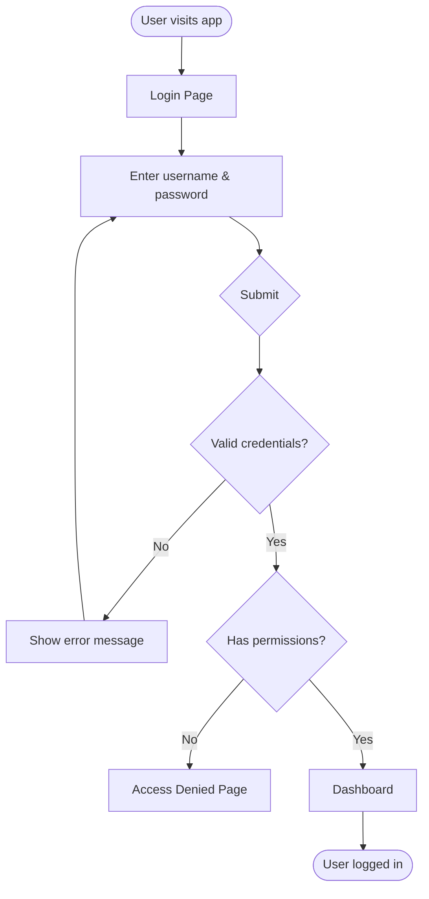

### 1.2 Session Management

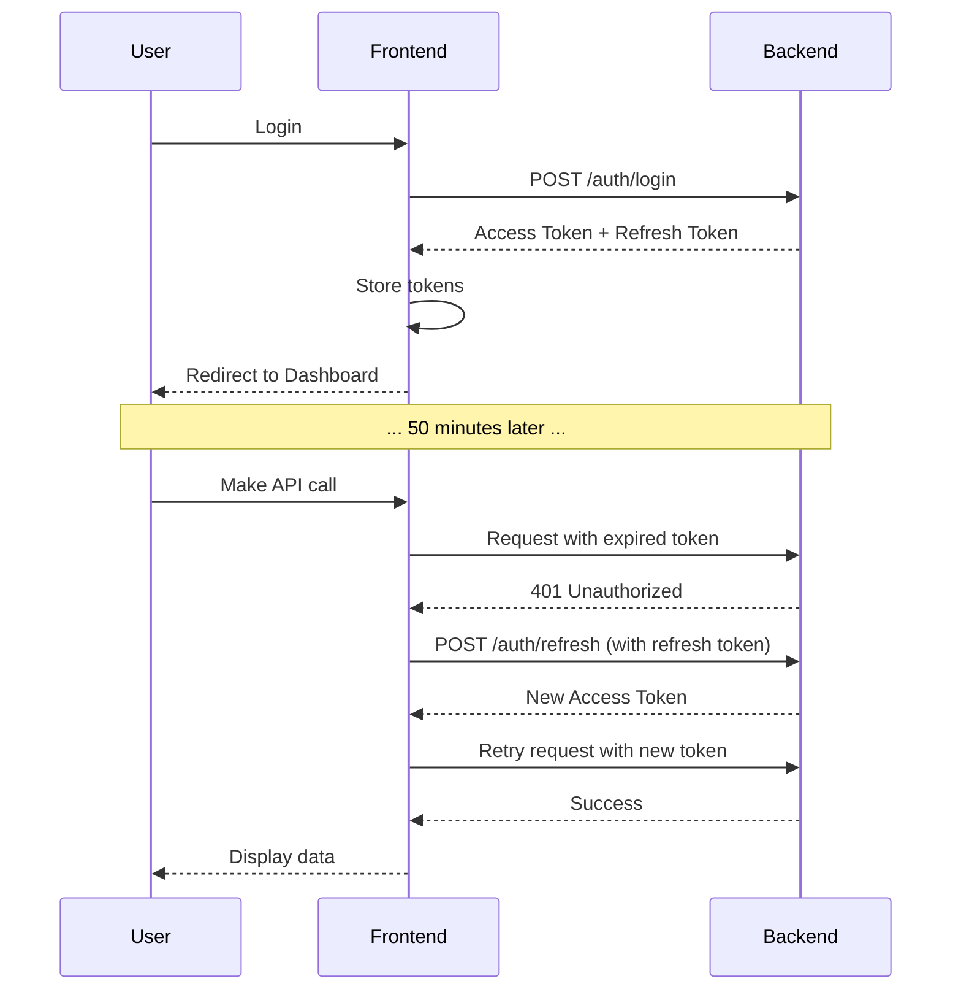

---

## 2. Voucher Creation Flow

### 2.1 Journal Voucher Entry

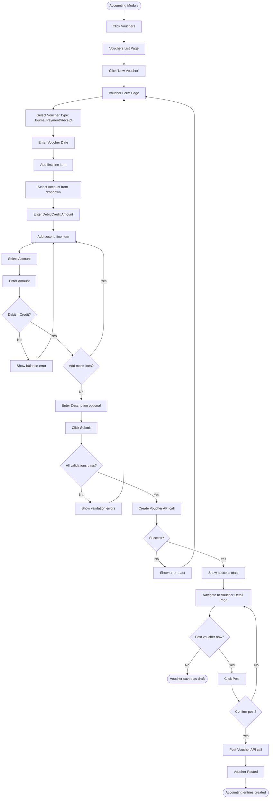

### 2.2 Voucher Screen States

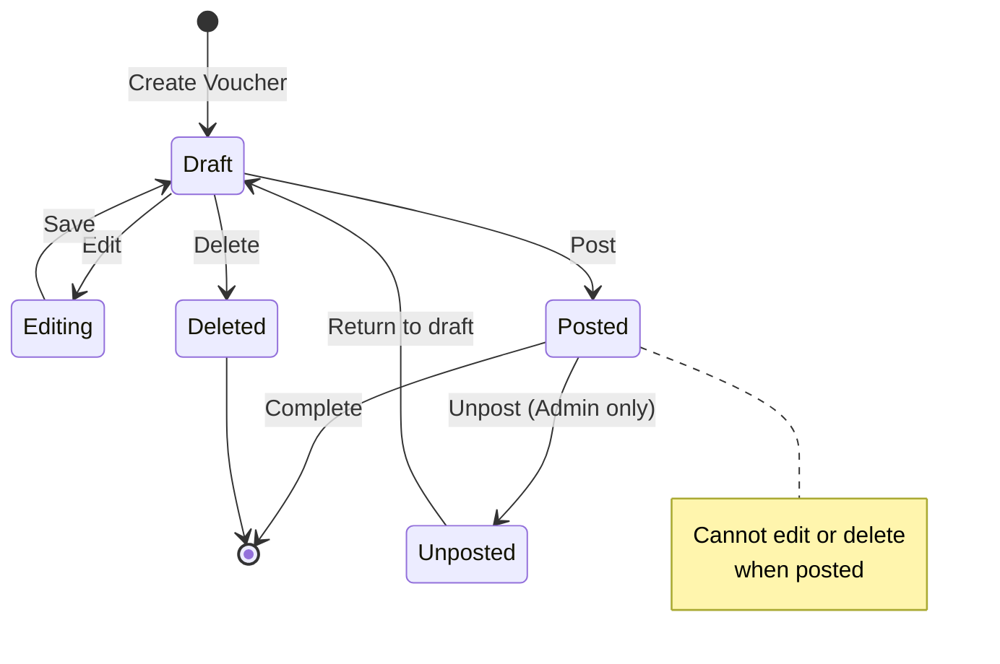

---

## 3. GRN (Goods Receipt Note) Flow

### 3.1 Creating a GRN

```mermaid
graph TD
    Start([Warehouse Module]) --> WarehouseMenu[Warehouse Menu]
    WarehouseMenu --> GRNList[GRN List Page]
    GRNList --> ClickNewGRN[Click 'New GRN']
    ClickNewGRN --> GRNForm[GRN Form Page]
    
    GRNForm --> Step1[Step 1: Header Details]
    Step1 --> SelectSupplier[Select Supplier Account]
    SelectSupplier --> EnterDate[Enter GRN Date]
    EnterDate --> EnterVehicle[Enter Vehicle Number optional]
    EnterVehicle --> NextToDetails[Click Next]
    
    NextToDetails --> Step2[Step 2: Product Details]
    Step2 --> AddProduct[Add Product Line]
    AddProduct --> SelectProduct[Select Product]
    SelectProduct --> SelectVariety[Select Variety optional]
    SelectVariety --> SelectPacking[Select Packing type]
    SelectPacking --> SelectRoom[Select Storage Room]
    SelectRoom --> SelectRack[Select Rack optional]
    SelectRack --> EnterQty[Enter Quantity]
    EnterQty --> EnterRate[Enter Rate]
    EnterRate --> CalcAmount[Amount auto-calculated]
    
    CalcAmount --> AddBags{Track bag weights?}
    AddBags -->|Yes| BagDetails[Enter Bag Details Modal]
    BagDetails --> EnterBagNumber[Enter Bag Number]
    EnterBagNumber --> EnterWeight[Enter Weight]
    EnterWeight --> AddMoreBags{Add more bags?}
    AddMoreBags -->|Yes| EnterBagNumber
    AddMoreBags -->|No| SaveBags[Save Bag Details]
    SaveBags --> AddMoreProducts
    
    AddBags -->|No| AddMoreProducts{Add more products?}
    AddMoreProducts -->|Yes| AddProduct
    AddMoreProducts -->|No| Step3[Step 3: Labour & Carriage]
    
    Step3 --> EnterLabour[Enter Labour Amount optional]
    EnterLabour --> SelectLabourAcc[Select Labour Accounts]
    SelectLabourAcc --> EnterCarriage[Enter Carriage Amount optional]
    EnterCarriage --> ReviewGRN[Step 4: Review]
    
    ReviewGRN --> ShowSummary[Display GRN Summary]
    ShowSummary --> ConfirmCreate{Confirm?}
    ConfirmCreate -->|No| GoBack[Go back to edit]
    GoBack --> Step1
    ConfirmCreate -->|Yes| AutoPost{Auto-post voucher?}
    
    AutoPost --> SubmitGRN[Submit GRN]
    SubmitGRN --> CreateAPI[Create GRN API call]
    CreateAPI --> UpdateStock[Stock automatically updated]
    UpdateStock --> VoucherCreated{Voucher auto-created?}
    VoucherCreated -->|Yes| ShowVoucherLink[Show link to accounting voucher]
    VoucherCreated -->|No| NoVoucher[No voucher created]
    ShowVoucherLink --> SuccessPage[GRN Success Page]
    NoVoucher --> SuccessPage
    SuccessPage --> Actions{Next action?}
    
    Actions -->|Print GRN| PrintGRN[Generate PDF]
    Actions -->|View Details| GRNDetail[GRN Detail Page]
    Actions -->|New GRN| GRNForm
    Actions -->|Back to List| GRNList
```

### 3.2 GRN Form Layout

```
┌─────────────────────────────────────────────────────────────┐
│ New Goods Receipt Note (GRN)                    [X] Close   │
├─────────────────────────────────────────────────────────────┤
│                                                               │
│ ① Header ──── ② Products ──── ③ Charges ──── ④ Review      │
│   [Active]     [Pending]       [Pending]       [Pending]     │
│                                                               │
├─────────────────────────────────────────────────────────────┤
│  Step 1: Header Information                                  │
│                                                               │
│  GRN Date: [________] (calendar picker)                      │
│                                                               │
│  Supplier: [Select Supplier Account ▼]                       │
│            (Searchable dropdown with autocomplete)           │
│                                                               │
│  Vehicle Number: [__________] (optional)                     │
│                                                               │
│  Invoice Grace Days: [___] days                              │
│                                                               │
│  Remarks: [_____________________________________]            │
│           [_____________________________________]            │
│                                                               │
├─────────────────────────────────────────────────────────────┤
│  [Cancel]                                [Next: Products →]  │
└─────────────────────────────────────────────────────────────┘
```

---

## 4. Invoice Generation Flow

### 4.1 Creating an Invoice

```mermaid
graph TD
    Start([Billing Module]) --> InvoiceList[Invoices List Page]
    InvoiceList --> NewInvoice[Click 'New Invoice']
    NewInvoice --> InvoiceForm[Invoice Form]
    
    InvoiceForm --> SelectCustomer[Select Customer Account]
    SelectCustomer --> EnterDate[Enter Invoice Date]
    EnterDate --> SelectGRN[Select GRN Details to Bill]
    
    SelectGRN --> GRNModal[GRN Selection Modal]
    GRNModal --> FilterGRN{Filter GRNs}
    FilterGRN --> ShowAvailable[Show unbilled GRN items for customer]
    ShowAvailable --> SelectItems[Select GRN line items to bill]
    SelectItems --> SetPeriod[Set Invoice Period: Daily/Seasonal/Monthly]
    SetPeriod --> SetRate[Set Rate per unit]
    SetRate --> CalcMonths[System calculates storage months]
    
    CalcMonths --> ShowCalc[Display calculation breakdown]
    ShowCalc --> AddLabour[Add labour charges from GDN/transfers]
    AddLabour --> AddLoading[Add loading charges]
    AddLoading --> SubtotalCalc[Subtotal calculated]
    
    SubtotalCalc --> AddTaxes[Add Taxes]
    AddTaxes --> IncomeTax[Set Income Tax %]
    IncomeTax --> Withholding[Set Withholding Tax %]
    Withholding --> TotalCalc[Total amount calculated]
    
    TotalCalc --> CashReceived{Cash received?}
    CashReceived -->|Yes| EnterCash[Enter cash amount]
    EnterCash --> Balance[Balance calculated]
    CashReceived -->|No| Balance
    
    Balance --> Review[Review Invoice]
    Review --> Submit{Submit}
    Submit -->|Cancel| InvoiceList
    Submit -->|Save| CreateInvoice[Create Invoice API]
    
    CreateInvoice --> AutoPostVoucher{Auto-post accounting voucher?}
    AutoPostVoucher -->|Yes| PostVoucherAPI[Create & Post Voucher]
    AutoPostVoucher -->|No| SaveOnly[Save as Draft]
    
    PostVoucherAPI --> InvoiceCreated[Invoice Created & Posted]
    SaveOnly --> InvoiceCreated
    
    InvoiceCreated --> NextAction{Next action?}
    NextAction -->|Print| GeneratePDF[Generate Invoice PDF]
    NextAction -->|Email| SendEmail[Send Email to Customer]
    NextAction -->|View| InvoiceDetail[View Invoice Details]
    NextAction -->|New| InvoiceForm
```

### 4.2 Invoice Calculation Breakdown Component

```
┌──────────────────────────────────────────────────────┐
│ Invoice Line Items                                    │
├──────────────────────────────────────────────────────┤
│                                                        │
│ Line 1:                                                │
│   Product: Red Potato Ration                          │
│   Quantity: 100 bags                                   │
│   Rate: PKR 50 per bag per month                       │
│   Storage Period: 45 days (1.5 months calculated)     │
│   Gross Amount: PKR 7,500                              │
│   Labour Charges: PKR 200                              │
│   Loading Charges: PKR 100                             │
│   Line Total: PKR 7,800                                │
│                                                        │
│ [+ Add Another Line]                                   │
│                                                        │
├──────────────────────────────────────────────────────┤
│ Summary                                                │
│   Subtotal:           PKR 7,800.00                     │
│   Income Tax (5%):    PKR   390.00 [+]                 │
│   Withholding (1%):   PKR   (78.00) [-]                │
│   ─────────────────────────────────                   │
│   Total Amount:       PKR 8,112.00                     │
│                                                        │
│   Cash Received:      PKR 5,000.00 [Edit]             │
│   Balance:            PKR 3,112.00                     │
└──────────────────────────────────────────────────────┘
```

---

## 5. Dashboard Navigation

### 5.1 Main Dashboard Flow

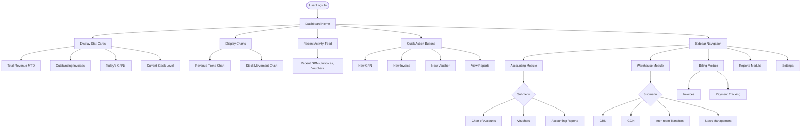

### 5.2 Dashboard Layout

```
┌────────────────────────────────────────────────────────────────┐
│  Advance ERP                    [🔍 Search]  [🔔]  [👤 Admin ▼]│
├──────┬─────────────────────────────────────────────────────────┤
│      │  Dashboard                                   Oct 15, 2025│
│  🏠  │                                                           │
│      │  ┌──────────────┐ ┌──────────────┐ ┌──────────────┐    │
│ Acc. │  │ Total Revenue│ │ Outstanding  │ │  Today's GRNs│    │
│  ▼   │  │  PKR 2.5M    │ │  PKR 450K    │ │      12      │    │
│      │  │  ↑ 12% MTD   │ │  18 invoices │ │   ↑ 3 more   │    │
│ War. │  └──────────────┘ └──────────────┘ └──────────────┘    │
│  ▼   │                                                           │
│      │  Revenue Trend (Last 30 Days)                            │
│ Bill │  ┌─────────────────────────────────────────────────┐    │
│  ▼   │  │        ╱╲                                       │    │
│      │  │     ╱╲╱  ╲    ╱╲                                │    │
│ Rep. │  │  ╱╲╱      ╲╱╲╱  ╲                               │    │
│  ▼   │  │╱                 ╲                              │    │
│      │  └─────────────────────────────────────────────────┘    │
│ Set. │                                                           │
│      │  Recent Activity                  Quick Actions          │
│      │  ┌─────────────────────────────┐ ┌─────────────────┐   │
│      │  │ GRN-2025-0123 created       │ │  + New GRN      │   │
│      │  │ 2 mins ago                  │ │  + New Invoice  │   │
│      │  │                             │ │  + New Voucher  │   │
│      │  │ INV-2025-0456 posted        │ │  📊 Reports     │   │
│      │  │ 15 mins ago                 │ └─────────────────┘   │
│      │  └─────────────────────────────┘                        │
└──────┴─────────────────────────────────────────────────────────┘
```

---

## 6. Report Generation Flow

### 6.1 Trial Balance Report

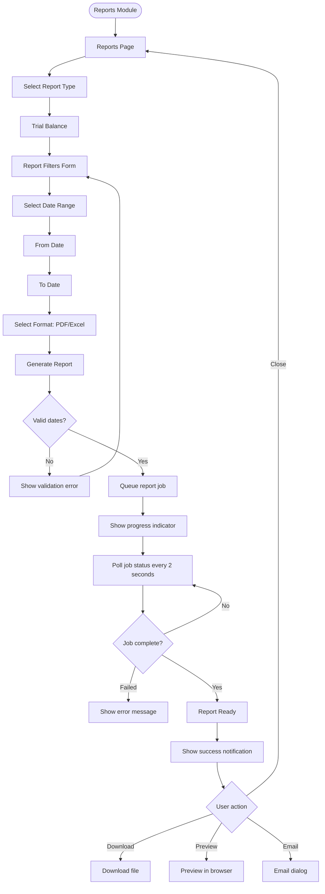

### 6.2 Report Progress UI

```
┌──────────────────────────────────────────────────┐
│ Generating Trial Balance Report...               │
├──────────────────────────────────────────────────┤
│                                                    │
│  ⚙️  Fetching account data...                     │
│                                                    │
│  [████████████████████████████        ] 75%       │
│                                                    │
│  Estimated time remaining: 15 seconds              │
│                                                    │
│  [Cancel Generation]                               │
│                                                    │
└──────────────────────────────────────────────────┘
```

---

## 7. User Management Flow

### 7.1 Creating a User

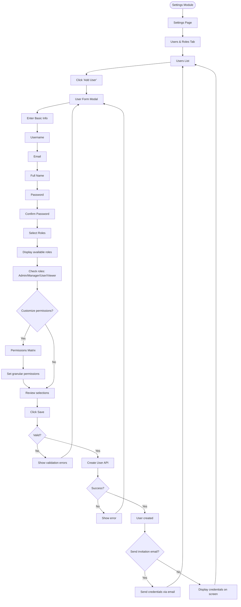

---

## 8. Account Selection Component (Reusable)

### 8.1 Account Selector Flow

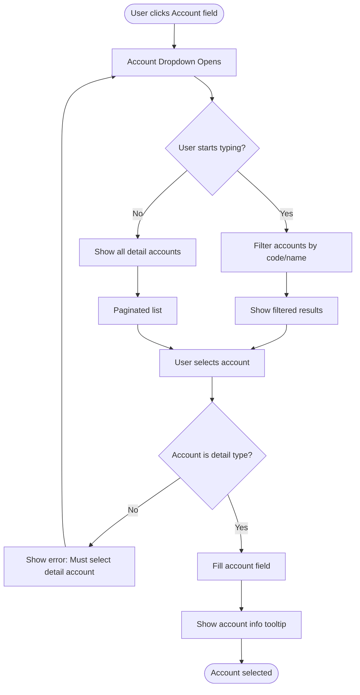

### 8.2 Account Selector UI

```
┌──────────────────────────────────────────────────┐
│ Select Account                                    │
├──────────────────────────────────────────────────┤
│ [🔍 Search by code or name... _____________]     │
├──────────────────────────────────────────────────┤
│                                                    │
│ ▼ 01 - Assets                                     │
│   ▶ 01-01 - Fixed Assets                          │
│   ▼ 01-02 - Current Assets                        │
│     ▶ 01-02-01 - Inventory                        │
│     ▶ 01-02-02 - Accounts Receivable              │
│                                                    │
│ ▼ 02 - Potato Customers                           │
│     02001 - Customer A ⭐                          │
│     02002 - Customer B                             │
│     02003 - Customer C                             │
│                                                    │
│ ▶ 03 - Bank Accounts                              │
│ ▶ 04 - Cash Accounts                              │
│                                                    │
└──────────────────────────────────────────────────┘
```

---

## 9. Mobile Responsive Flow

### 9.1 Mobile Navigation

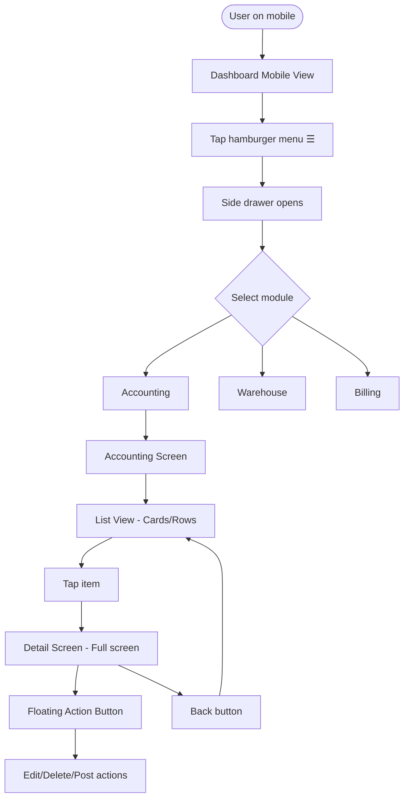

### 9.2 Mobile Screen Flow

```
Mobile: List View          Mobile: Detail View
┌─────────────────┐       ┌─────────────────┐
│ ← Vouchers      │       │ ← Back    ⋮ Menu│
├─────────────────┤       ├─────────────────┤
│                 │       │ JV-2025-0001    │
│ ┌─────────────┐│       │ Jan 15, 2025    │
│ │ JV-2025-0001││       │                 │
│ │ Jan 15      ││       │ Description:    │
│ │ PKR 50,000  ││       │ Rent Payment    │
│ │ Posted ✓    ││       │                 │
│ └─────────────┘│       │ Lines:          │
│                 │       │ ┌─────────────┐│
│ ┌─────────────┐│       │ │ Cash A/c    ││
│ │ JV-2025-0002││  -->  │ │ Dr: 50,000  ││
│ │ Jan 16      ││       │ └─────────────┘│
│ │ PKR 25,000  ││       │ ┌─────────────┐│
│ │ Draft       ││       │ │ Rent Exp.   ││
│ └─────────────┘│       │ │ Cr: 50,000  ││
│                 │       │ └─────────────┘│
│      [+]        │       │                 │
└─────────────────┘       │   [Edit] [Post] │
                          └─────────────────┘
```

---

## 10. Error Handling & User Feedback

### 10.1 Error Scenarios

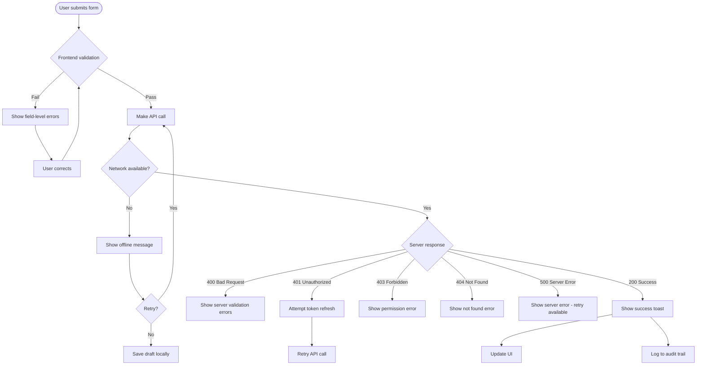

### 10.2 Notification Types

```
Success Notification
┌──────────────────────────────────────┐
│ ✓ Voucher created successfully!      │
│   View Details →                      │
└──────────────────────────────────────┘

Error Notification
┌──────────────────────────────────────┐
│ ⚠ Failed to post voucher             │
│   Debit and credit must be equal     │
│   [Retry] [Dismiss]                   │
└──────────────────────────────────────┘

Info Notification
┌──────────────────────────────────────┐
│ ℹ Report generation started          │
│   You'll be notified when ready      │
└──────────────────────────────────────┘

Loading State
┌──────────────────────────────────────┐
│ ⏳ Creating voucher...                │
│   [■■■■■■■□□□□□□□□] 50%              │
└──────────────────────────────────────┘
```

---

## 11. Permission-Based UI

### 11.1 Conditional Rendering

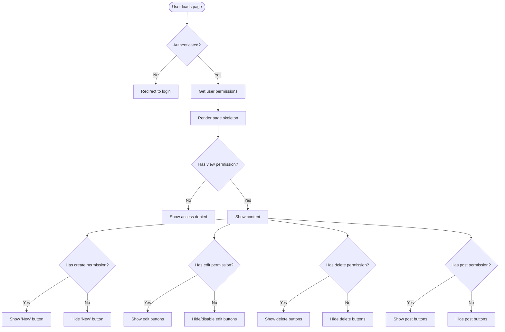

### 11.2 Permission Matrix Example

```
User: John Doe (Role: Manager)

Module         | View | Create | Edit | Delete | Post
─────────────────────────────────────────────────────
Accounts       |  ✓   |   ✓    |  ✓   |   ✗    |  N/A
Vouchers       |  ✓   |   ✓    |  ✓   |   ✗    |  ✓
GRN            |  ✓   |   ✓    |  ✓   |   ✗    |  N/A
Invoices       |  ✓   |   ✓    |  ✓   |   ✓    |  ✓
Reports        |  ✓   |   ✓    | N/A  |  N/A   |  N/A
Users          |  ✗   |   ✗    |  ✗   |   ✗    |  N/A
Settings       |  ✗   |   ✗    |  ✗   |   ✗    |  N/A

✓ = Allowed    ✗ = Denied    N/A = Not applicable
```

---

## 12. Real-Time Updates (WebSocket)

### 12.1 WebSocket Event Flow

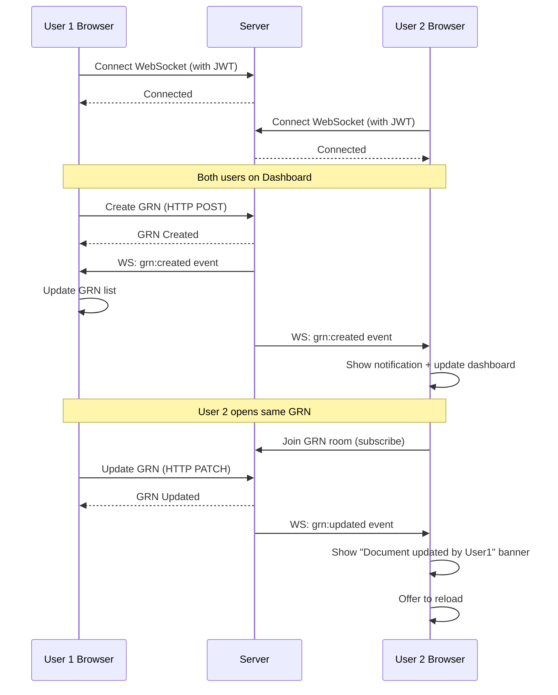

### 12.2 Real-Time Notification UI

```
┌──────────────────────────────────────────────────┐
│ Dashboard                               🔔 (3)    │
├──────────────────────────────────────────────────┤
│                                                    │
│ 💡 GRN-2025-0145 was created by Ahmed             │
│    2 seconds ago • View →                          │
│                                                    │
│ 💡 Invoice INV-2025-0567 was posted by Sara       │
│    1 minute ago • View →                           │
│                                                    │
│ 💡 Voucher JV-2025-0890 awaiting your approval    │
│    5 minutes ago • Approve →                       │
│                                                    │
└──────────────────────────────────────────────────┘
```

---

## Conclusion

These UI flows provide a comprehensive view of user interactions in the modernized Advance ERP system. Key takeaways:

1. **Guided workflows** - Step-by-step processes for complex operations
2. **Clear navigation** - Intuitive menu structure and breadcrumbs
3. **Responsive design** - Optimized for desktop and mobile
4. **Permission-based UI** - Dynamic rendering based on user roles
5. **Real-time updates** - WebSocket-powered live notifications
6. **Error handling** - Comprehensive feedback for all scenarios
7. **Accessibility** - Keyboard navigation and screen reader support

**Next Steps:**
- Create high-fidelity mockups in Figma
- Build interactive prototypes
- Conduct user testing with stakeholders
- Refine based on feedback

---

**Document Version:** 1.0  
**Author:** ERP Modernization AI Architect  
**Related Documents:** `frontend_structure.md`, `api_spec.yaml`, `backend_blueprint.md`

